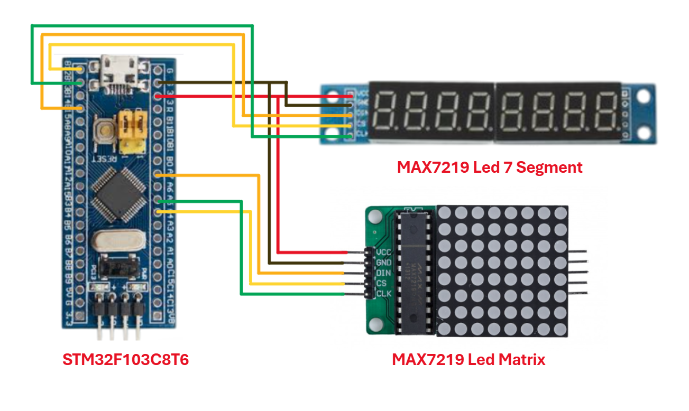
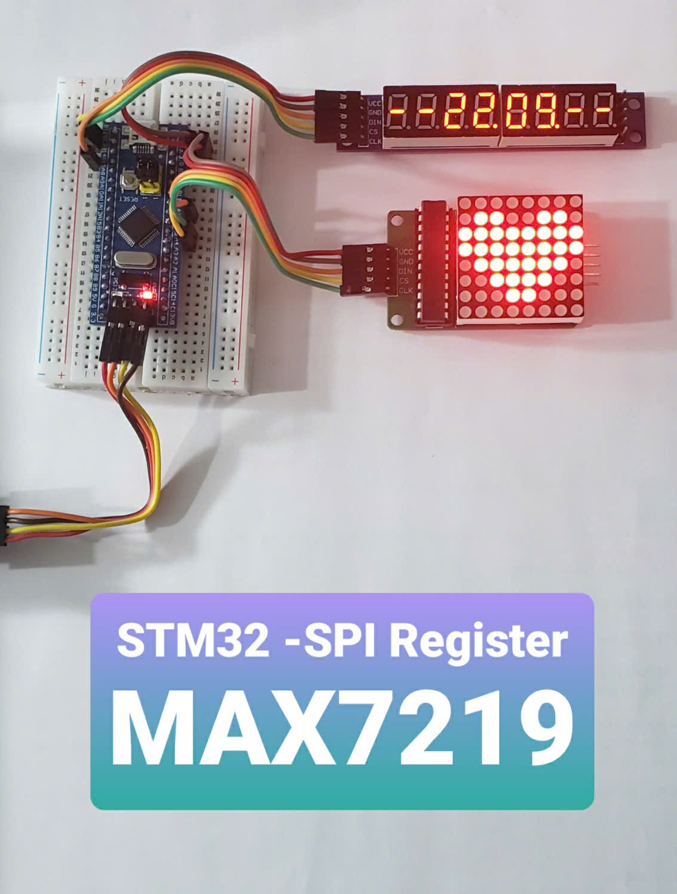

# STM32-SPI | Coding love with MAX7219: Heart & Her Name on LEDs 💖
Author: **Kaël Shelby** (VTN)

## 💡 1. Introduction

- This project demonstrates how the **STM32F103C8T6** microcontroller communicates with **MAX7219** modules via SPI.  
- The firmware creates simultaneous display effects on both modules, highlighting how to configure **multiple independent SPI peripherals on STM32** and apply them in LED control.  


Main objectives of the project:  
- Understand how to configure and use **multiple SPI interfaces on STM32**  
- Get familiar with controlling **MAX7219 using register-level (bare-metal CMSIS) code**  
- Generate intuitive LED effects for learning or demonstration purposes  

---

## 🛠️ 2. Hardware Requirements

To implement this project, you will need:

- **STM32F103C8T6 (BluePill board)**
- **MAX7219 LED Matrix 8x8** (1 module)
- **MAX7219 LED 7-Segment (8 digits)** (1 module)
- Jumper wires (Male–Female)
- 5V power supply (via ST-Link USB or external module)
- ST-Link V2 (or USB-UART) for programming

---

## 🔌 3. Circuit Diagram


                              ### MAX7219 LED Matrix (SPI1)
                              | STM32F103C8T6 | MAX7219 |
                              |---------------|---------|
                              | PA5 (SCK)     | CLK     |
                              | PA7 (MOSI)    | DIN     |
                              | PA4 (CS)      | CS      |
                              | 5V            | VCC     |
                              | GND           | GND     |

---

                              ### MAX7219 LED 7-Segment (SPI2)
                              | STM32F103C8T6 | MAX7219 |
                              |---------------|---------|
                              | PB13 (SCK)    | CLK     |
                              | PB15 (MOSI)   | DIN     |
                              | PB12 (CS)     | CS      |
                              | 5V            | VCC     |
                              | GND           | GND     |

---

👉 Notes:  
- Both modules share **VCC (5V)** and **GND**.  
- Each module has its own **CS pin** for device selection during SPI communication.  
- **MISO is not required** since MAX7219 is write-only (no data returned).  

---

## 🎥 4. Demo and Results
👉 [Watch the demo video](https://www.tiktok.com/@kshelbyiot/video/7532704226988936456?is_from_webapp=1&sender_device=pc&web_id=7500959777037518344)

<p align="center">
  <a href="https://www.tiktok.com/@kshelbyiot/video/7532704226988936456?is_from_webapp=1&sender_device=pc&web_id=7500959777037518344">
    
  </a>
</p>

---

## 🚀 5. Getting Started

1. **Clone the project from GitHub**  
   ```bash
   git clone <url>
2. **Open the project with Keil C (uVision)**
- Main source file: main.c
- Code is written in pure register-level CMSI(bare-metal)
3. **Connect hardware according to the diagram in Section 3**
4. **Flash the firmware using ST-Link V2 or USB-UART**
5. **Expected Results:**
- LED Matrix displays images (heart, text, effects, …)
- LED 7-Segment displays characters/numbers